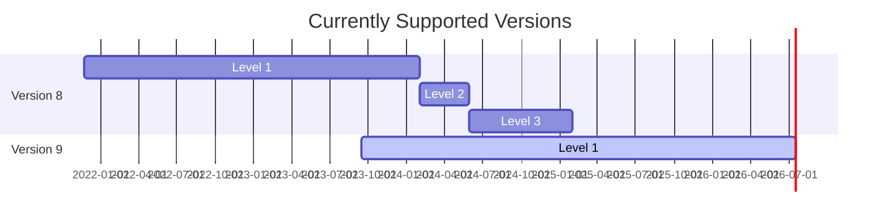

# Adyen Payment plugin for Magento 2
Use Adyen's plugin for Magento 2 to offer frictionless payments online, in-app, and in-store.

## Integration
The plugin integrates card component (Secured Fields) using Adyen Checkout for all card payments. For Point Of Sale (POS) payments we use Terminal API using Cloud-based communication.

### Support Vault and Instant Purchase ###
Inside Adyen toggle the following settings on inside the API and Responses section (Settings -> API and Responses):
* Recurring details
* Card bin
* Card summary
* Expiry date
* Variant

## Requirements
This plugin supports Magento 2 version 2.4.4 and higher.

## Releases

1. **Major** releases are done ONLY when absolutely required. We try to not to introduce breaking changes and do major releases as rare as possible. Current average is **yearly**.
2. A minor or a patch release is scheduled but not limited to **once every 2 weeks.**

**Note: This can be subject to change based on the load and dependancies of the Integration tools team.**

## Support & Maintenance

We provide three levels of support:
1. **Level 1 (12 months)**: full support (including new features) *Keep in mind that some new features are not possible on older versions, therefore this is not inclusive of ALL new features that are built.*
2. **Level 2 (12 months - 18 months)**: high priority bugs / security only.
3. **Level 3 (18 months - 24 months)**: security updates only (no support from support team).

> After Level 3 there is no support or maintenance from Adyen and it should be treated as a native integration of the merchant.

The schedule for the current maintained branches is:

|  Plugin Major Version   | Release Date  | Level 1 Support ends | Level 2 Support ends | Level 3 Support ends |
|  :-----          |:--------------|:---------------------|:---------------------|:---------------------|
|  Version 8 |  November 2021 | January 2024         | May 2024             | January 2025         |
|  Version 9 | October 2023  | December 2025      | May 2026             | December 2026               |

Or, visualised as a calendar:



## Contributing
We strongly encourage you to join us in contributing to this repository so everyone can benefit from:
* New features and functionality
* Resolved bug fixes and issues
* Any general improvements

Read our [**contribution guidelines**](CONTRIBUTING.md) to find out how.


## Installation
You can install our plugin through Composer:
```
composer require adyen/module-payment
bin/magento module:enable Adyen_Payment
bin/magento setup:upgrade
```
For more information see our [installation section](https://docs.adyen.com/developers/plugins/magento-2/set-up-the-plugin-in-magento?redirect#step1installtheplugin).

## Documentation
- [Magento 2 documentation](https://docs.adyen.com/plugins/adobe-commerce)
- [V9 migration guide](https://docs.adyen.com/plugins/adobe-commerce/migrate-to-a-new-version)

## Setup Cron
Make sure that your Magento cron is running every minute. We are using a cronjob to process the notifications (our webhook service) and to update Adyen servers' IP addresses. The cronjobs will be executed every minute.

```
<group id="adyen_payment">
    <job name="adyen_payment_process_notification" instance="Adyen\Payment\Model\Cron" method="processNotification">
        <schedule>*/1 * * * *</schedule>
    </job>
    <job name="adyen_payment_server_address_caching" instance="Adyen\Payment\Cron\ServerIpAddress" method="execute">
        <schedule>*/1 * * * *</schedule>
    </job>
</group>
```

The notification processing service queries the records that have been received at least 2 minutes ago. This is to ensure that Magento has created the order, and all save after events are executed. A handy tool to get insight into your cronjobs is AOE scheduler. You can download this tool through Magento Marketplace or GitHub.

If you need to setup your cronjob in Magento <a href="http://devdocs.magento.com/guides/v2.0/config-guide/cli/config-cli-subcommands-cron.html" target="_blank">this is described here</a>.

## Supported payment methods

See our [documentation](https://docs.adyen.com/plugins/adobe-commerce/supported-payment-methods/) for a full list of supported payment methods.

## Support
If you have a feature request, or spotted a bug or a technical problem, create a GitHub issue. For other questions, contact our [support team](https://support.adyen.com/hc/en-us/requests/new?ticket_form_id=360000705420).

## API Library
This module is using the Adyen APIs Library for PHP for all (API) connections to Adyen.
<a href="https://github.com/Adyen/adyen-php-api-library" target="_blank">This library can be found here</a>

## License
MIT license. For more information, see the [LICENSE](LICENSE.txt) file.
